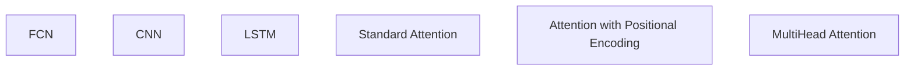
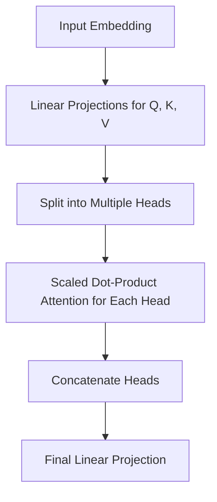

## Blog Post 1: Introduction to Attention Mechanisms with a Toy Dataset

### Title:
**Demystifying Attention Mechanisms with a Toy Dataset: From Baselines to Basic Attention and Positional Encoding**

---

## 1. Introduction

In this post, we explore how a simple synthetic time series can serve as a playground for understanding various sequence modeling techniques. Our dataset consists of 1D sequences (length 500) where each sample contains several non-overlapping "shapes" (triangles, rectangles, semicircles, etc.) drawn at different positions and amplitudes. The target for each sample is generated by redrawing these shapes with the group-average amplitude per shape type (i.e. removing individual noise).

*Figure Suggestion (plot_1_01_dataset_example):*
An illustration that overlays a sample input sequence in one color (e.g. blue) and the corresponding target sequence in another (e.g. red).

# Model Overview Diagram
Below is a high-level diagram illustrating the different models explored in this post:

---

## 2. Baseline Models

We begin by comparing several classical architectures on our synthetic dataset:

### 2.1 Fully Connected Network (FCN)
- **Description:**
  The FCN model flattens the entire sequence and passes it through multiple dense layers. Although it lacks explicit modeling of local structure, it demonstrates how a global averaging approach might work.
- **Figure (plot_1_02_fcn_architecture):**
  A diagram of the FCN architecture.

### 2.2 Convolutional Neural Network (CNN)
- **Description:**
  CNNs capture local patterns by sliding convolutional filters over the sequence. This model is better at modeling local features compared with the FCN.
- **Figure (plot_1_03_cnn_architecture):**
  A schematic that shows a 1D convolution sliding over portions of the sequence.

### 2.3 Recurrent Neural Network (RNN - LSTM)
- **Description:**
  RNNs (especially LSTM/GRU) maintain temporal connections and learn sequential dependencies by processing the sequence step by step.
- **Figure (plot_1_04_rnn_architecture):**
  An unrolled view of an LSTM network.

---

## 3. Standard Attention Mechanisms

Beyond these baselines, we examine attention-based models.

### 3.1 Basic Dot-Product Attention
- **Concept:**
  The core idea is to compute the dot product between a query and key vectors, scale it, and then apply softmax to generate attention weights that are used to obtain a weighted sum of value vectors.
- **Mathematical Formulation:**
  \[
  \text{Attention}(Q, K, V) = \text{softmax}\left(\frac{QK^\top}{\sqrt{d_k}}\right)V
  \]
- **Figure (plot_1_05_attention_mechanism):**
  A diagram illustrating how a query attends to multiple keys and gathers information from the value vectors.

### 3.2 Multi-Head Attention
- **Description:**
  Instead of a single attention operation, multiple attention "heads" operate in parallel, which allows the model to capture diverse aspects of the input.
- **Figure (plot_1_06_multihead_attention):**
  A schematic showing multiple attention heads alongside their outputs.

#### Multi-head attention performs several attention operations in parallel. This is achieved by:
- Splitting the input embedding into multiple heads.
- Applying separate linear transformations for each head.
- Computing scaled dot-product attention for each head.
- Concatenating the outputs and applying a final linear projection.

Below is a diagram that summarizes these steps:

Each attention head learns its own representation because they each use distinct weight matrices for the linear projections. This diversity ensures that the heads capture different features and do not collapse into identical representations.

### 3.3 Positional Encoding
- **Description:**
  Positional information is essential because attention is permutation-invariant. In this post, we'll focus on the standard sinusoidal encoding approach:
  - **Sinusoidal Encoding:** Fixed formulas that use sine and cosine functions to encode position information, allowing the model to learn relative positions effectively.
  *Note: We'll explore alternative positional encoding methods like linear, learnable, and rotary (RoPE) encodings in our next post on advanced attention mechanisms.*
- **Figure (plot_1_07_positional_encoding):**
  A visualization showing how sinusoidal positional encoding works and its effect on the input sequence.

---

## 4. Comparative Analysis

Once all models are trained and validated on a common validation set, we compare them on several metrics:

- **Trainable Parameters:**
  We count the number of parameters for each model.
- **Training Time:**
  Total time spent training.
- **Validation Loss:**
  Average loss on a fixed validation set.
- **Inference Latency:**
  Average inference time per example during validation.
- **Sample Predictions:**
  We plot the model predictions (for 5 representative examples) together with the input and target sequences.

*Figure Suggestion (plot_1_08_comparative_metrics):*
A table/plot that summarizes parameters, training time, validation loss, and inference time for each model.

*Figure Suggestion (plot_1_09_validation_predictions):*
A side-by-side series of plots showing, for example, 5 validation samples with the input, ground truth, and predictions from each model.

---

## 5. Conclusions and Outlook

In this post, we aimed to build intuition for key ideas that power modern attention-based systems. By comparing standard baselines with attention-based models (both with and without positional encodings), we see how these mechanisms better capture global dependencies in the data. In the coming posts, we will extend these ideas to efficient, sparse, and adaptive variants and further explore how transformers process images in vision tasks.

Stay tuned for the next installment where we tackle efficient and sparse attention mechanisms!

---

*End of Blog Post 1*
